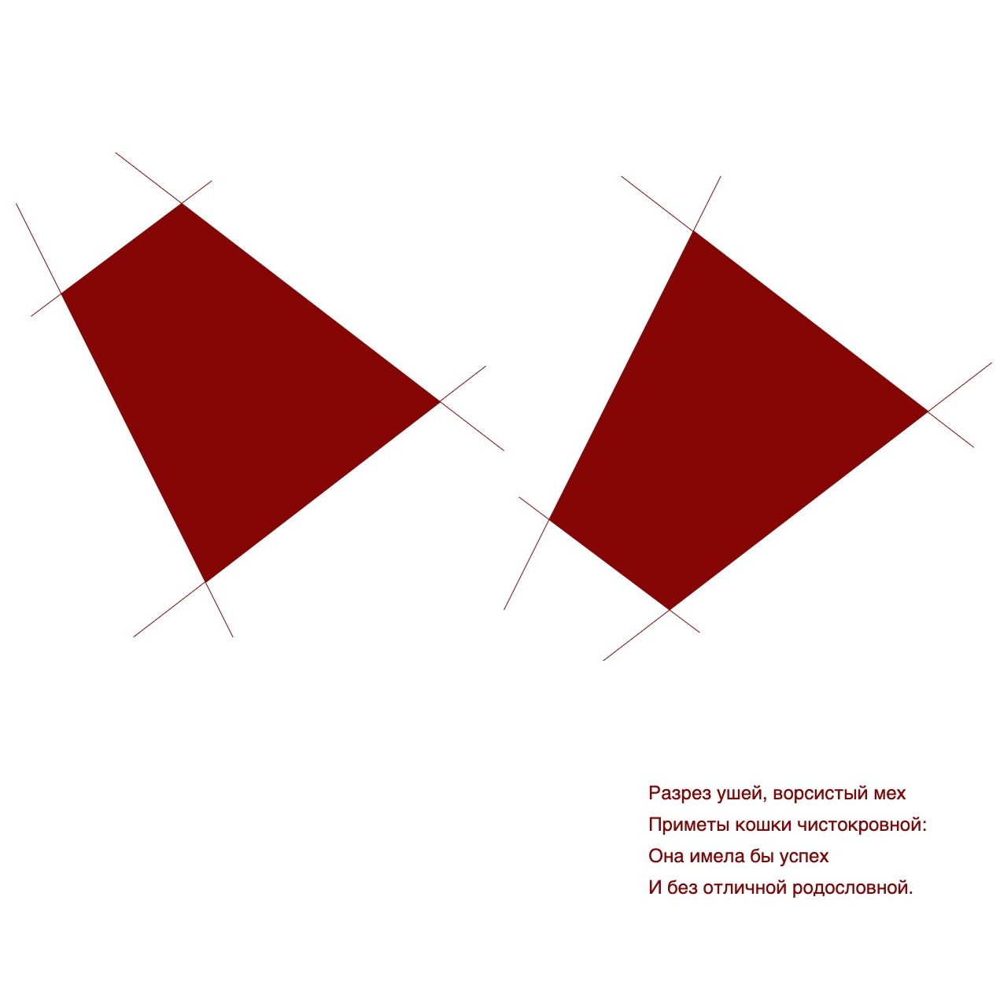

## Sanguine Experiments



### Run

```
npm install
npm start
```

A local version will now be running on [localhost:3000](http://localhost:3000)

### Implementation Details

I used [this template](https://github.com/Gaweph/p5-typescript-starter) as a quick starter.